# Inventory Management System

A simple web app built with Django to keep track of stock in a small store/warehouse with different functionalities such as  add items, update quantities, get low-stock alerts, manage vendors and orders, and generate basic reports.

## Overview

This is a Django project that lets a small business manage its inventory online instead of using a notebook or an Excel sheet. There are two kinds of users: **Admin** and **Staff**. Staff can log in and update stock levels. Admins can do everything staff can do, plus manage vendors, place orders, run reports, and view the demand forecast.

When stock for an item gets low (or hits zero, or is close to its expiry date), the system automatically creates an alert so nobody forgets to reorder.

## Problem Statement

Small stores/restaurants/warehouses often track inventory manually (paper, spreadsheets, or just memory). This causes problems like:

- Running out of stock without noticing until it's too late
- Items expiring because nobody was tracking the date
- No record of who changed stock levels or why
- No easy way to see usage trends over time
- Ordering from vendors with no history of past orders

This project tries to solve that by giving the business one place to manage stock, vendors, orders, and reports.

## Objectives

- Let staff log stock changes (restock, usage, wastage) with a reason
- Automatically warn the admin when stock is low, empty, or about to expire
- Keep a history of every stock change (who did it and when)
- Let admins manage vendors and place/track orders
- Give a very simple demand forecast based on past usage
- Generate usage/wastage reports for a chosen date range
- Restrict certain pages to Admins only (role-based access)

## Features

- User registration and login (with roles: Admin / Staff)
- Add inventory items (name, unit, quantity, minimum threshold, expiry date)
- Update stock (restock / usage / wastage) with an optional reason, logged in `StockLog`
- Dashboard showing all items and the 5 most recent unread alerts
- Automatic alert generation for low stock, out-of-stock, and items expiring within 3 days
- Mark alerts as read
- Vendor directory (add vendor, see basic info + quality rating)
- Order placing and delivery confirmation (confirming delivery restocks the item automatically)
- Simple 7-day forecast based on the last 30 days of usage, with reorder suggestions
- Usage/Wastage report by date range
- Django admin panel for direct database management

## Technologies Used

- **Python 3** – the language the whole backend is written in
- **Django (5.x)** – the web framework. It handles routing, the database layer (ORM), the built-in admin panel, forms, authentication, and templating, so I didn't have to build any of that from scratch
- **SQLite** – the database. Django uses this by default and it needs zero setup (no need to install and configure something like PostgreSQL)
- **Django's built-in auth system** – used for login/logout/password hashing instead of writing custom authentication (safer and less code)
- **HTML + CSS (vanilla)** – the templates and the one stylesheet (`style.css`) for styling. No frontend framework was used, everything is rendered server-side with Django templates
- **JavaScript** – there's a `script.js` file included for future use, but currently the site doesn't need any custom JS since everything is done with normal form submissions

## Project Structure

```
ims/
├── manage.py                  # Django's command-line tool, used to run the server, make migrations, etc.
├── requirements.txt           # Only dependency: Django
├── screenshots/                # Screenshots of the app used in this README
├── ims_project/                # The main project settings folder
│   ├── settings.py            # All Django configuration (database, apps, auth, timezone, etc.)
│   ├── urls.py                # Root URL config — sends requests to the inventory app
│   ├── wsgi.py / asgi.py      # Entry points used when deploying the server
│
└── inventory/                  # The actual app — this is where all the logic lives
    ├── models.py               # Database tables (User, InventoryItem, Vendor, Order, Alert, Forecast, Report, StockLog)
    ├── views.py                 # The functions that handle each page/request
    ├── forms.py                  # Django forms used for registration, adding items, updating stock, etc.
    ├── urls.py                    # Maps URLs like /inventory/ to a view function
    ├── admin.py                    # Registers models so they show up in Django's built-in admin panel
    ├── decorators.py                # Custom @admin_required / @staff_or_admin_required decorators for permissions
    ├── apps.py                       # Standard Django app config file
    ├── migrations/                    # Auto-generated files that create the database tables
    ├── templates/inventory/            # All the HTML pages (login, dashboard, inventory list, etc.)
    └── static/inventory/                # CSS and JS files
```

## Installation

1. **Clone the repository**
   ```bash
   git clone <https://github.com/kripa1717/Software_engineering_lab>
   cd ims
   ```

2. **Create and activate a virtual environment** (recommended so Django doesn't get installed globally)
   ```bash
   python -m venv venv
   # Windows
   venv\Scripts\activate
   # Mac/Linux
   source venv/bin/activate
   ```

3. **Install the requirements**
   ```bash
   pip install -r requirements.txt
   ```

4. **Run the database migrations** (this creates the SQLite tables)
   ```bash
   python manage.py migrate
   ```

5. **Create a superuser** (so you can log in to the Django admin panel at `/admin/`)
   ```bash
   python manage.py createsuperuser
   ```

6. **Run the server**
   ```bash
   python manage.py runserver
   ```

7. Open your browser at `http://127.0.0.1:8000/`

**Environment variables:** none are used right now.The `SECRET_KEY` is hardcoded in `settings.py` 

## How the Software Works

1. A user opens the site and lands on the login page (this is also the home page).
2. New users can register . They pick a username, email, password, and a role (Admin or Staff).
3. Once logged in, the user is taken to the **Dashboard**, which runs a background check (`_check_low_stock_and_expiry_alerts`) that scans every item and auto-creates alerts if stock is low/empty or something is close to expiring.
4. From the navbar, staff can go to **Inventory** to view items and update stock (this creates a `StockLog` entry every time).
5. Admins additionally see **Vendors**, **Orders**, **Forecast**, and **Reports** in the navbar and these pages are protected with the `@admin_required` decorator, so a Staff account can't reach them even by typing the URL directly.
6. **Alerts** page shows every alert generated so far, and lets a user mark them as read.
7. **Forecast** looks at the last 30 days of "Usage" stock logs for every item, averages that over 4 weeks, and suggests items that might need reordering.
8. **Reports** lets an admin pick a date range and a type (Usage or Wastage) and get a summed-up table of stock changes in that window.
9. **Orders** lets an admin place an order with a vendor, and "Confirm Delivery" automatically adds the ordered quantity back into stock and logs it.

## Screenshots

### Login
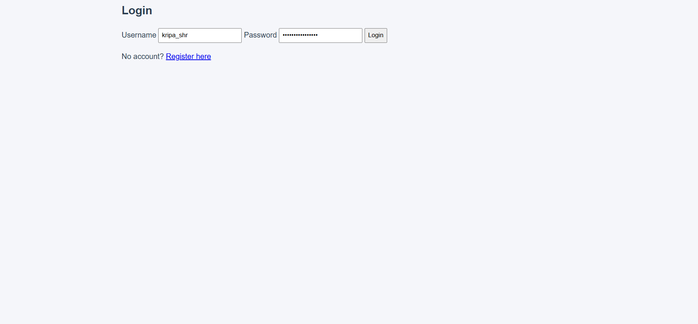

### Registering a New User
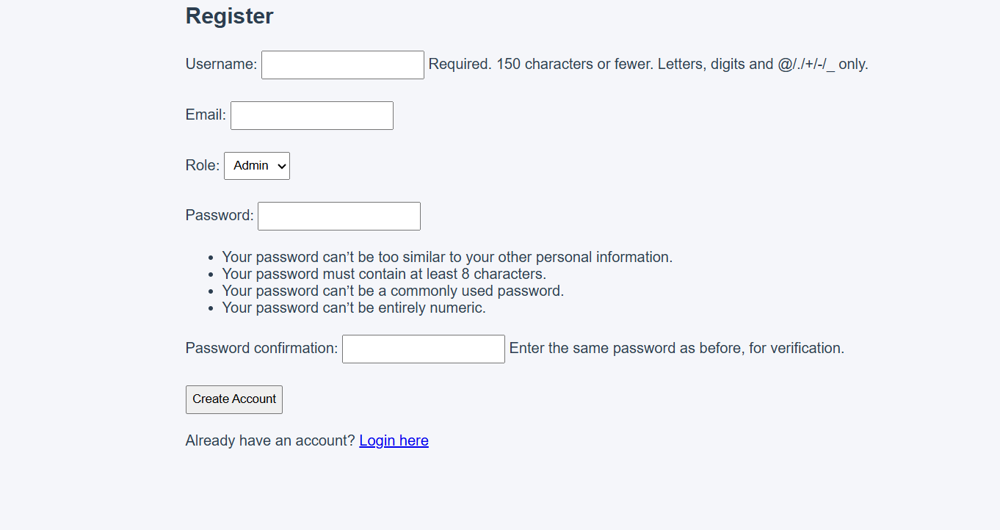

### Main Dashboard
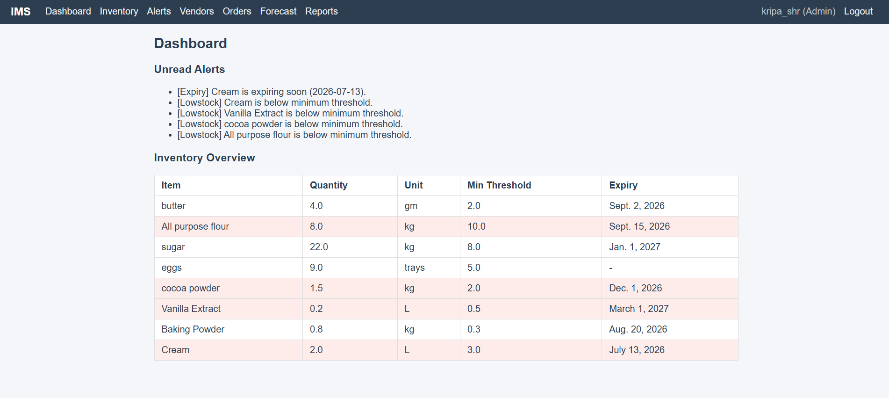

### Inventory Dashboard
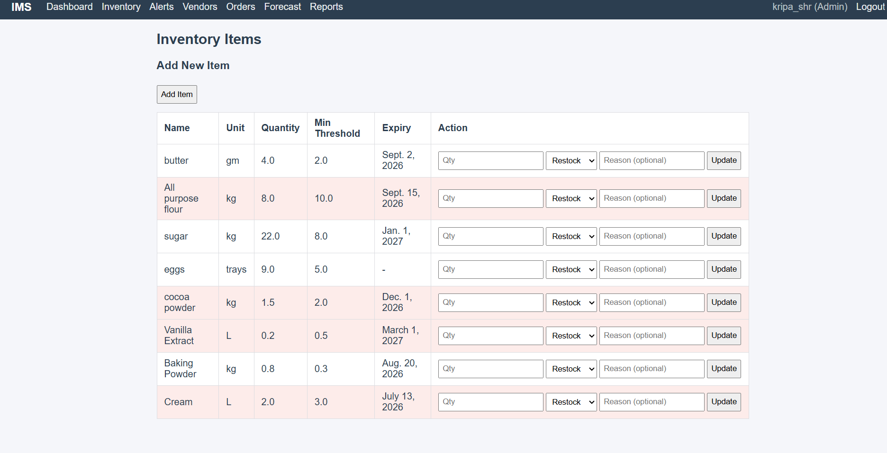

### Adding Items to Inventory
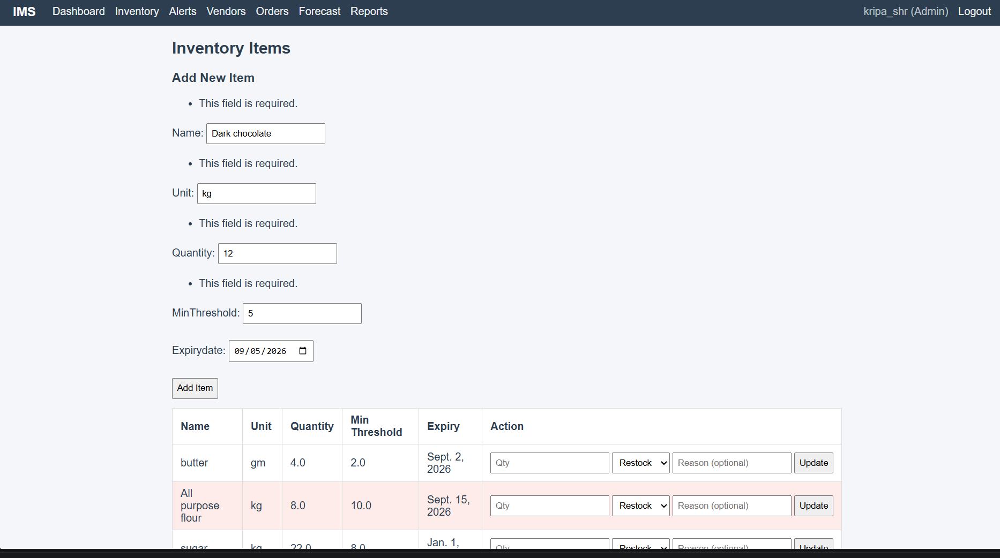

### Item Added Successfully
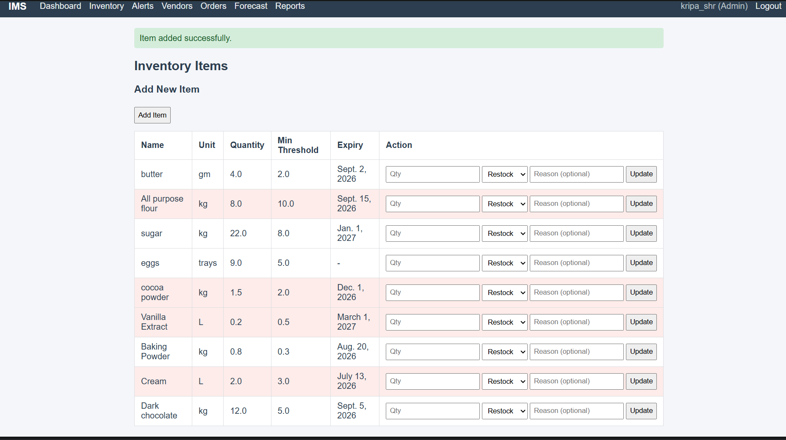

### Alerts
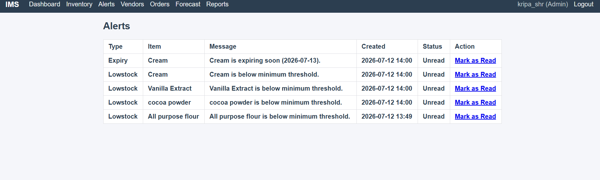

### Vendor Management
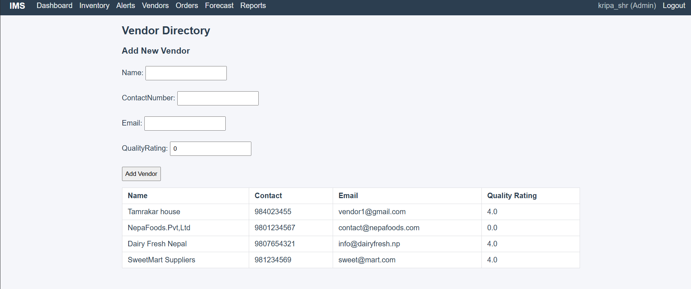

### Placing an Order
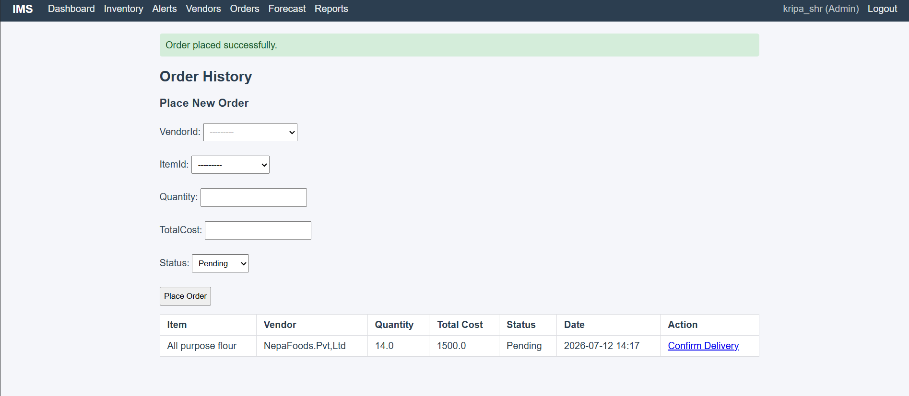

### Demand Forecast
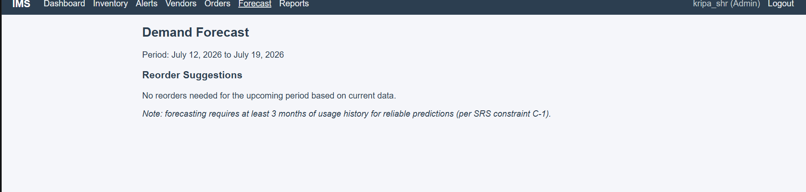

### Report
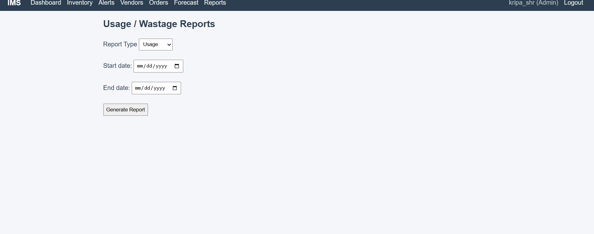


## Future Improvements

- Move `SECRET_KEY` and `DEBUG` into environment variables before deploying anywhere
- Add proper unit tests (there are currently none in the project)
- Add PDF/CSV export for reports (the `Report.exportPDF()` and `exportcsv()` methods exist but are empty)
- Better forecasting (right now it's just a simple 4-week average, nothing statistical)
- Pagination for the inventory/orders/alerts tables once the data grows
- Nicer UI — right now it's plain HTML/CSS with no framework like Bootstrap

## Limitations

- No email/SMS notifications — alerts are only visible inside the app (`sendNotifications()` is a placeholder)
- The forecast logic is very basic (simple average, not a real forecasting model)
- No automated tests included
- `SECRET_KEY` is not secured for production use
- No pagination — all records load on one page

## Contributors

- *Kripa Shrestha*
